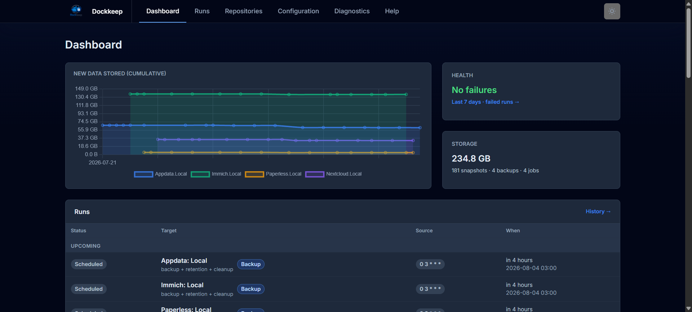
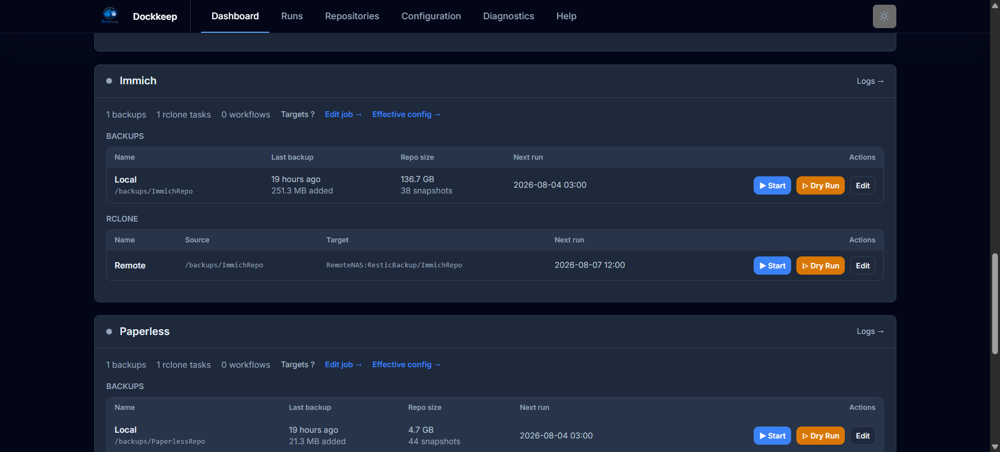
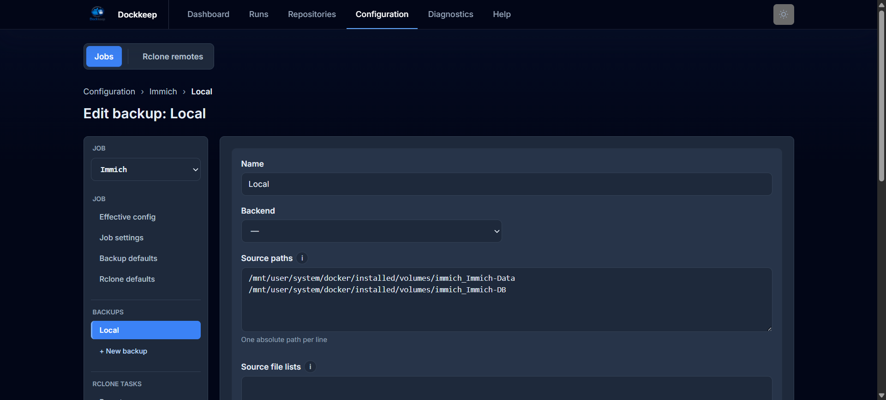
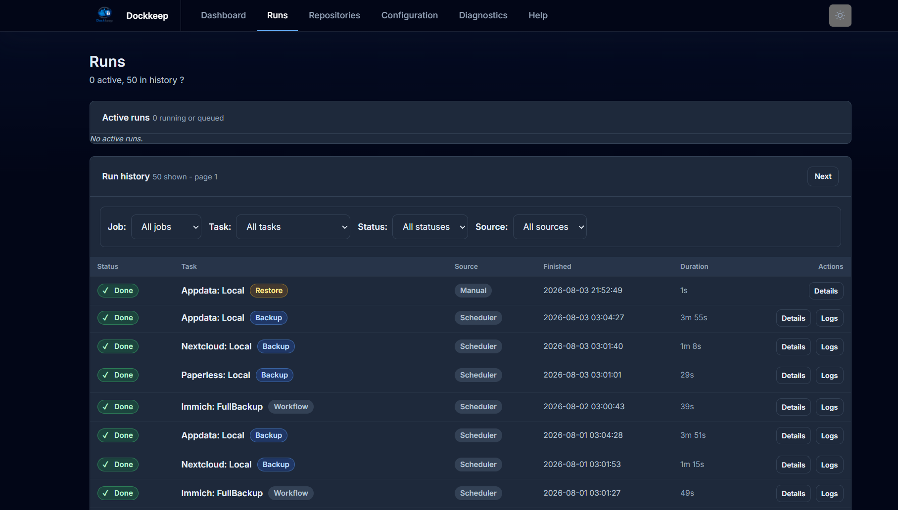
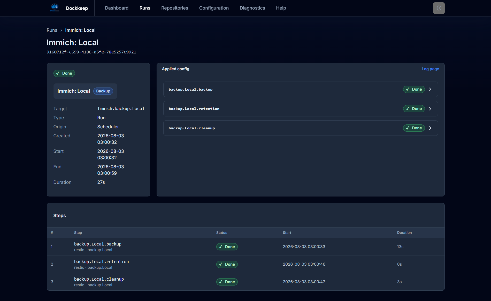
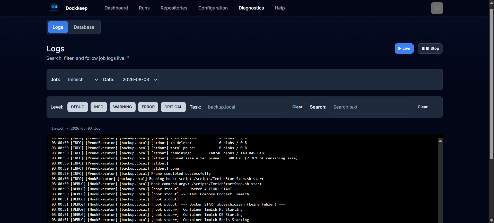
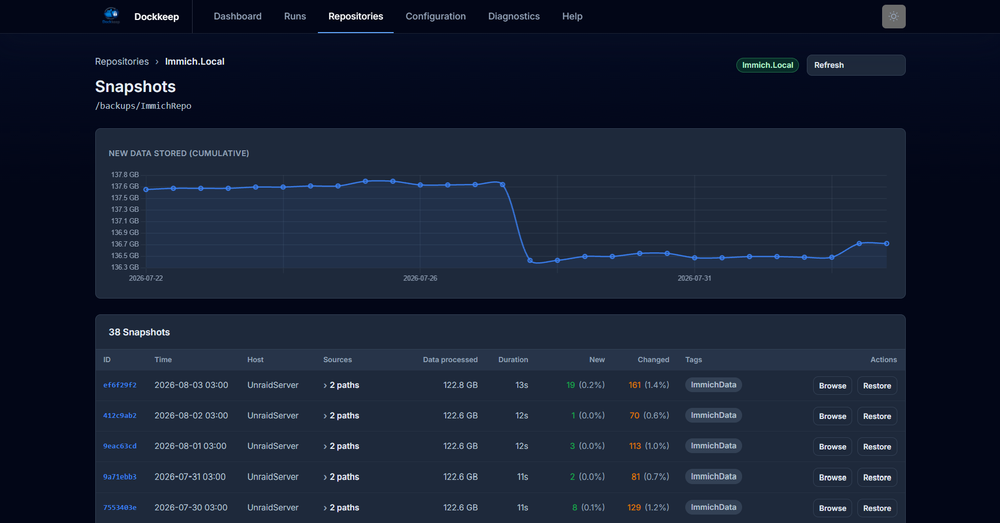
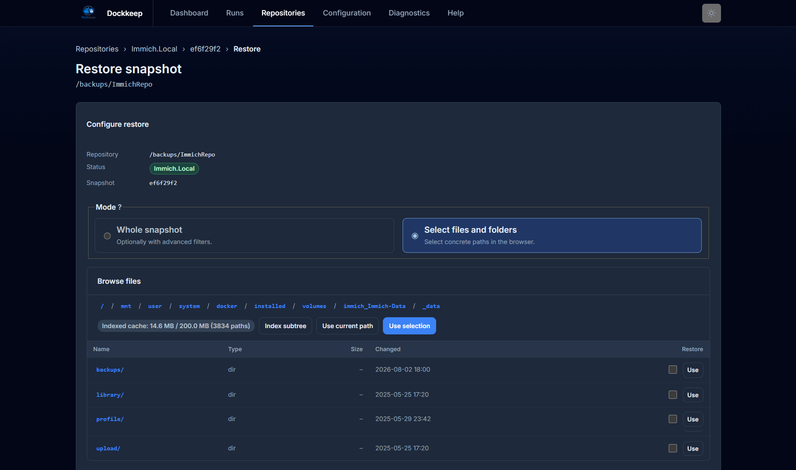

<p align="center">
  
</p>

<h1 align="center">Self-hosted Restic backups and Rclone syncs, with a web UI</h1>

<p align="center">
  <strong>Scheduled backups for your home server, NAS, or Unraid box — all in one container.</strong>
</p>

---

Dockkeep runs the backups you would otherwise write cron jobs and shell scripts
for. You describe *what* to back up, *where to*, and *when* in the web UI; under
the hood Dockkeep stores that as one plain TOML file you can still read, review,
and edit. It then takes care of running the jobs, keeping snapshots pruned,
uploading copies off-site, logging everything, telling you when something
breaks, and getting your files back when you need them.

Underneath it is plain [Restic](https://restic.net/) and
[Rclone](https://rclone.org/). Dockkeep does not invent a backup format and does
not hide the tools: your repositories stay ordinary Restic repositories that any
`restic` binary can read, with or without Dockkeep. That is deliberate — the day
you need your data back is the worst possible day to depend on a tool that is
also broken.

It is built for local, trusted environments: self-hosted home servers, homelabs,
NAS and Unraid boxes, small internal machines.

> **Versioning.** Dockkeep follows semantic versioning: the configuration
> format and the container contract stay compatible within a major version, and
> any change to them is listed in that release's notes — so pinning a version
> tag means nothing changes under you. Your repositories are never affected:
> they are plain Restic repositories and no release rewrites them.

<p align="center">
  
</p>

## Contents

- [What you can do with it](#what-you-can-do-with-it)
- [Screenshots](#screenshots)
- [How Dockkeep is organized](#how-dockkeep-is-organized)
- [Requirements](#requirements)
- [Installation](#installation)
- [Your first backup](#your-first-backup)
- [Two modes: UI or headless](#two-modes-ui-or-headless)
- [Volumes, paths, and what lives where](#volumes-paths-and-what-lives-where)
- [Environment variables](#environment-variables)
- [The configuration model](#the-configuration-model)
- [Passwords](#passwords)
- [Rclone remotes](#rclone-remotes)
- [Notifications](#notifications)
- [Hooks](#hooks)
- [Command line reference](#command-line-reference)
- [Using Restic and Rclone directly](#using-restic-and-rclone-directly)
- [Operating Dockkeep](#operating-dockkeep)
- [Disaster recovery: getting data back without Dockkeep](#disaster-recovery-getting-data-back-without-dockkeep)
- [Troubleshooting](#troubleshooting)
- [What Dockkeep deliberately does not do](#what-dockkeep-deliberately-does-not-do)
- [License](#license)

## What you can do with it

**Back up directories with Restic.** Point a backup at one or more mounted host
directories and a repository — a local path or a cloud location through Restic's
Rclone backend. Add excludes, tags, file lists, and per-backup Restic arguments
when you need them.

**Keep several copies.** A job can hold as many backups as you like: one to the
local disk, one to a NAS, one to object storage. Each has its own schedule,
retention, and credentials, and each is modeled as its own backup target.

**Prune old snapshots automatically.** Turn on retention and set the Restic keep
rules (`keep_daily`, `keep_weekly`, `keep_within`, …). Turn on cleanup as well
and Dockkeep prunes the repository afterwards so the freed space is actually
returned.

**Mirror repositories off-site with Rclone.** An Rclone task copies (or syncs) a
local directory to any Rclone remote. A deleting sync refuses to start when the
source directory is missing or empty, so an unmounted volume cannot wipe the
remote copy.

**Chain steps into workflows.** A workflow runs backups, single backup substeps,
and Rclone tasks in a fixed order — "back up, prune, then upload" as one
scheduled unit that stops at the first failure.

**Schedule it, or run it by hand.** Every backup, Rclone task, and workflow takes
a five-field cron expression. Anything without a schedule simply waits until you
press Start. Dry runs pass `--dry-run` to Restic and Rclone and skip hooks, while
still exercising the real execution path.

**Watch what happened.** The dashboard shows active, upcoming, and recent runs;
the runs page keeps the history with filters and per-run details; the log viewer
shows every line a run produced, live while it is still running.

**Restore without the command line.** Browse a snapshot's contents in the UI,
tick the files and folders you want, dry-run the restore, then start it. For
large trees, use *Index subtree* in the browser to pre-load the current subtree
into Dockkeep's temporary browse cache so moving through folders is much faster.
Restores are confined to the restore directory and never overwrite each other by
default.

**See your repositories.** Dockkeep groups snapshots by physical repository (not
by config entry), shows size and growth over time, and keeps working even for
repositories a configuration no longer points at.

**Get told when something breaks.** Email and Pushover notifications for success,
failure, and skipped runs, plus an optional periodic report that also arrives when
nothing happened — so silence is never ambiguous.

**Run code around backups.** Pre, post, and on-error hooks stop a database before
the backup and start it afterwards, dump a database, or ping a monitoring
service. The image ships the clients for that (`docker`, `ssh`, `pg_dump`,
`mysqldump`, `redis-cli`, `sqlite3`, `curl`, `jq`).

**Keep the backend within reach.** `dk shell` opens a shell with the repository
and credentials of a configured backup already exported, so `restic check`,
`restic unlock`, or any other maintenance is one command away.

## Screenshots

<p align="center">
  
  <br>
  <em>Every job with its backups and Rclone tasks: last backup, repository size, next run — and Start, Dry Run, and Edit one click away.</em>
</p>

<p align="center">
  
  <br>
  <em>Every field of a backup in a form, with inherited values marked as such — the editor writes <code>config.toml</code> and keeps your comments and formatting.</em>
</p>

<p align="center">
  
  <br>
  <em>Every run, manual or scheduled, with its status and duration.</em>
</p>

<p align="center">
  
  <br>
  <em>A workflow run, step by step.</em>
</p>

<p align="center">
  
  <br>
  <em>The full output of a run, live while it is still running.</em>
</p>

<p align="center">
  
  <br>
  <em>Repositories grouped by their physical identity, with size and growth over time.</em>
</p>

<p align="center">
  
  <br>
  <em>Browse a snapshot, tick what you need, dry-run it, restore it — no command line.</em>
</p>

## How Dockkeep is organized

The UI is the normal way to create and maintain these objects. It writes a
single `config.toml` behind the scenes, so the file stays readable, portable,
and easy to back up, but you do not have to start there.

Five concepts show up everywhere in the app and in the TOML:

**Job** — a grouping that owns shared defaults, hooks, and notification settings.
Typically one job per thing you back up (`paperless`, `nextcloud`, `homeserver`).

**Backup** — one Restic repository, with its sources, schedule, retention rules,
and credentials. A job can have many: `myjob.backup.local`, `myjob.backup.nas`.

**Rclone task** — one copy or sync from a local directory to a remote, with its
own schedule.

**Workflow** — an ordered list of steps built from the backups and Rclone tasks of
the same job.

**Target** — how one of those things is named internally, in a workflow step, or
in the optional CLI:

```text
myjob.backup.local                 # the backup plan: backup, then retention/cleanup if enabled
myjob.backup.local.backup          # only the snapshot
myjob.backup.local.retention       # only forget
myjob.backup.local.cleanup         # only prune
myjob.rclone.offsite
myjob.workflow.nightly
```

Names may contain letters, digits, hyphens, and underscores only. The dots are
structure, and the UI builds them for you. `_system` and
`__dockkeep_adhoc_restore__` are reserved as job names, `rclone` is reserved as
a backup and workflow name, and the structured editor additionally refuses
`new`.

Two rules explain most of Dockkeep's behavior:

**Settings inherit downwards: global → job → backup / workflow / Rclone task.**
An unset field takes the value from the level above; an explicit value (including
an explicit `false`) stops inheritance for everything below it. This is why a
backup entry can be four lines long and still do the right thing. The UI has an
*Effective config* page per job that shows the resolved result.

**Runs lock the resources they touch, not the jobs they belong to.** A backup
locks its repository, an Rclone step locks its source and target, a workflow
holds the union of its steps' resources for its whole runtime. Two jobs writing
to the same repository can therefore never collide; two jobs touching nothing in
common run in parallel. A lock conflict never waits forever: a scheduled run is
recorded as *skipped*, a manually started one as *lock error*.

## Requirements

- **An x86_64 (amd64) host.** The published image is built for amd64 only —
  there is no arm64 build yet, so Raspberry Pi and ARM-based NAS models are not
  supported. On an ARM host the container exits immediately with
  `exec format error`.
- Docker with Docker Compose
- A host directory to back up, mountable into the container
- A Restic password — via environment variable or a mounted password file
- Optional: an `rclone.conf` if you use cloud repositories or Rclone tasks

> **The web UI ships without built-in authentication.** It is an administrative
> interface with full access to your configuration and secrets. Publish port 8080
> on a trusted network only, or put it behind a VPN or an authenticating reverse
> proxy.

## Installation

Dockkeep is deployed as a prebuilt image — you do not need this repository for
that. Create a directory for the deployment and put two files in it:

```bash
mkdir -p ~/dockkeep && cd ~/dockkeep
```

**`docker-compose.yml`** — replace the two source mounts with the directories you
want to back up, on both sides of the colon, and add or drop lines until the list
matches what you have. Mounting each source under its own host path keeps the
paths in your configuration identical to the paths you know from the host:

```yaml
services:
  app:
    image: ghcr.io/davidkrgh/dockkeep:latest
    container_name: dockkeep
    hostname: homeserver          # shows up as the Restic host of your snapshots
    restart: unless-stopped

    ports:
      - "8080:8080"               # web UI

    env_file:
      - .env

    volumes:
      # Configuration and generated app data
      - ./config:/config          # config.toml and rclone.conf, writable by the UI
      - ./appdata:/appdata        # run history, restore records, repository cache

      # Backup sources and targets
      # Each mount is a root: config.toml can use any path below it, so one line
      # per tree is enough. Read-only, and under its own host path.
      - /srv/data:/srv/data:ro
      - /srv/photos:/srv/photos:ro
      - ./backups:/backups        # local repositories
      - ./restore:/restore        # restore destinations

      # Logs
      - ./logs:/logs

      # Optional: hook scripts and Docker control from hooks
      # - ./scripts:/scripts
      # - /var/run/docker.sock:/var/run/docker.sock

    environment:
      TZ: ${TZ:-Europe/Berlin}
      DK_MODE: ${DK_MODE:-gui}    # gui = web UI + scheduler, cli = headless scheduler
```

**`.env`** — next to it, in the same directory. Compose reads it for the
variables above and passes it into the container via `env_file`:

```env
# Time zone: decides what "02:00" means for your schedules
TZ=Europe/Berlin

# gui = web UI + scheduler, cli = headless scheduler
DK_MODE=gui

# Repository password, referenced from config.toml as
# password_env = "DK_RESTIC_PASSWORD"
DK_RESTIC_PASSWORD=change-me

# Optional: notification credentials, referenced from config.toml as *_env
# SMTP_USER=backup@example.com
# SMTP_PASSWORD=change-me
# PUSHOVER_TOKEN=change-me
# PUSHOVER_USER_KEY=change-me

# Optional: run as a non-root user (both values or neither)
# PUID=1000
# PGID=1000
```

Keep `.env` private — it holds the password that decides whether your backups
are readable. A fuller, annotated version of this file is
[`.env.example`](.env.example) in this repository.

Start it:

```bash
docker compose up -d
```

Containers without explicit arguments start whatever `DK_MODE` selects — the web
UI on port 8080 by default. The entrypoint creates the directories it needs and,
on first start, an empty `/config/config.toml`. The UI comes up at
<http://localhost:8080> even without a valid configuration, so you can write the
first one from there.

To use a different port, change the left-hand side of the port mapping
(`"9090:8080"`); the container always listens on 8080 internally.

### Unraid

On Unraid you do not need a Compose file. Dockkeep ships an Unraid Community
Applications template: open the *Apps* tab, search for **Dockkeep**, and install
it. The template sets the same volumes and variables as the Compose example
above, with the paths pointed at the usual `/mnt/user/...` shares, and it lets
you pick between the `latest` and `1` image tags.

Two Unraid-specific notes:

- **Pick shares that already exist** for the repository and restore paths.
  Docker silently creates a new share otherwise, with cache settings you never
  chose.
- **Exclude Dockkeep's own `config` and `appdata` directories** from the backup
  sources. The config holds your repository passwords, and the SQLite database
  cannot be copied consistently while it is in use.

The template lives at [`templates/dockkeep.xml`](templates/dockkeep.xml) in this
repository, and questions about the Unraid build belong in the
[support thread](https://forums.unraid.net/topic/200129-support-d4v3-dockkeep/).

### Mounting sources

Back up what you mount, and mount it read-only where you can (`:ro`). Four
things are worth knowing up front:

- **Paths in the configuration are container paths.** If you mount
  `/srv/photos:/data/photos`, the source is `/data/photos`, not `/srv/photos`.
- **Snapshots record the container path.** Restoring later gives you back
  `/data/photos/...` inside the restore target. Keeping the mount layout stable
  makes restores predictable.
- **Mount each source under its host path.** Write `/srv/photos:/srv/photos:ro`
  instead, and there is nothing left to translate: the path on the host, the
  source in your configuration, the path recorded in the snapshot and the path
  you get back from a restore are all `/srv/photos`. The examples below follow
  this, and it is what saves you from the first two points.
- **A mount is a root, not a single source.** Everything below it can be named in
  the configuration. With `/srv/data:/srv/data:ro` in place, a backup can just as
  well use `sources = ["/srv/data/projects", "/srv/data/archive/2024"]` — no
  extra mount needed. You only add a second mount for a tree the first one does
  not already cover, which is why the example mounts `/srv/photos` separately.

### Image tags

All images are `linux/amd64`.

| Tag | Meaning |
|---|---|
| `latest` | Latest build of the default branch |
| `main` | Branch build (same content as `latest`) |
| `1.2.3` | Exact release — published from version tags |
| `1.2` | Latest patch of that minor release |

Pin a version tag if you would rather decide when to upgrade.

## Your first backup

1. **Create a job.** *Configuration → Jobs → + Create new job*.
2. **Add a backup.** In the job sidebar, *+ New backup*. Fill in the repository
   (e.g. `/backups/myjob`), the password source, and the sources to back up.
   Switch on *auto init* so Dockkeep creates the repository, and set retention
   with at least one keep rule if old snapshots should be pruned.
3. **Check the resolved values.** *Effective config* in the job sidebar shows
   what will actually be used after inheritance.
4. **Dry-run it.** On the dashboard, use *Dry Run* on the new backup. It walks
   the entire path without writing a snapshot. If *auto init* is enabled and the
   repository is missing, Dockkeep may still initialize that repository first.
5. **Run it.** Then *Start*. Watch it under *Runs*, read the output under
   *Diagnostics → Logs*.
6. **Add the schedule** once a manual run has succeeded. The scheduler picks up
   saved configuration changes on its next check — no restart needed.

The same backup is stored as plain TOML. You normally see it through the
structured editor, but the shape is useful to understand and easy to review in
Git:

```toml
[global.backup]
password_env = "DK_RESTIC_PASSWORD"
keep_daily   = 7
keep_weekly  = 4

[jobs.myjob.backup]
auto_init = true
retention = true

[jobs.myjob.backup.local]
repository = "/backups/myjob"
sources    = ["/srv/data", "/srv/photos"]
schedule   = "0 2 * * *"
```

When you hand-edit the file, validate it before trusting it:

```bash
docker exec dockkeep dk config validate
```

The UI's own **Help** page (`/help`) documents the day-to-day UI work in
detail: run statuses, the restore browser, the log viewer, repository refresh
and merging. This README covers everything around it — installation, the
configuration concepts, the CLI, and operations.

## Two modes: UI or headless

`DK_MODE` selects one of two strictly separated modes. Most people want `gui`.

|  | `DK_MODE=gui` (default) | `DK_MODE=cli` |
|---|---|---|
| Container starts | `dk-runtime gui` — web UI on port 8080, owns the scheduler | `dk-runtime scheduler` — headless, no port |
| Schedules run | yes | yes |
| Run history, repository cache, stats, restore registry | persisted in `/appdata` | **not written at all** |
| Available `dk` commands | `dk shell`, `dk config validate` | the full palette, including `dk run` |
| How you observe runs | UI, logs, notifications | exit codes, logs, notifications |

**Choose `gui`** unless you have a specific reason not to. It is the managed
mode: history, snapshot lists, size charts, and the restore browser all rely on
the AppData database, and the UI is where runs are started and inspected. The
restore browser can additionally index a snapshot subtree on demand; that
temporary browse cache is held by the running UI process and rebuilt when needed.

**Choose `cli`** when you want Dockkeep as a pure scheduling and execution layer
— driven from host cron, scripts, or another orchestrator — with no web
interface and no state beyond logs. In this mode `dk run` blocks until the run
finishes and returns a meaningful exit code, which is what makes it scriptable:

```bash
docker exec dockkeep dk run myjob.workflow.nightly || notify-my-monitoring
```

If you switch a container from `cli` back to `gui`, the repository cache is stale
because CLI runs never wrote to it. Press *Refresh* once on the Repositories
page and it catches up.

An unset or invalid `DK_MODE` is treated as `gui`, with a warning in the log.

## Volumes, paths, and what lives where

| Container path | Holds | Override |
|---|---|---|
| `/config/config.toml` | Your whole configuration | `DK_CONFIG_DIR` |
| `/config/rclone.conf` | Rclone remotes | `RCLONE_CONFIG` |
| `/backups` | Intended mount point for local repositories (a repository path is whatever you configure) | `DK_BACKUP_DIR` |
| `/restore` | Restore destinations; restores never write outside it | `DK_RESTORE_DIR` |
| `/logs/<job>/<date>.log` | Per-job run logs | `DK_LOG_DIR` |
| `/logs/_system/<date>.log` | Scheduler, config loading, UI, libraries | `DK_LOG_DIR` |
| `/appdata/appdata.db` | Run history, restore records, repository/snapshot cache, stats (GUI mode only) | `DK_APPDATA_DIR` |
| `/scripts` | Hook scripts; the only allowed location for script hooks | `DK_SCRIPTS_DIR` |
| `/var/lock` | Resource and scheduler lock files | `DK_LOCK_DIR` |

**What is irreplaceable, and what is not.** Only two things cannot be
regenerated: your **repositories** and the **credentials to read them**
(`config.toml`, `rclone.conf`, and wherever the passwords live — usually `.env`
or a password file). Back those up somewhere Dockkeep is not the only way to
reach them. `/appdata` is convenience state: repository and snapshot data can be
rebuilt from the repositories with *Refresh*, and losing run history costs you
nothing but history. Logs are logs.

## Environment variables

Everything with a UI field lives in `config.toml`. The variables below belong to
the container instead, and several of them exist *only* here.

| Variable | Default | Purpose |
|---|---|---|
| `DK_MODE` | `gui` | Operating mode, see above |
| `TZ` | container default | Time zone for schedules, next-run times, and log timestamps |
| `PUID` / `PGID` | — | Run as a non-root user, see below |
| `DK_ALLOW_INLINE_HOOKS` | `false` | Allow inline shell commands as hooks instead of script files only |
| `DK_APPDATA_RETENTION_DAYS` | — | Maximum age of persisted AppData records |
| `DK_APPDATA_RETENTION_COUNT` | — | Maximum number of persisted AppData records per group |
| `DK_STATS_TIMEOUT` | `600` | Time limit per follow-up `restic stats` / `restic snapshots` call |
| `DK_BROWSE_TIMEOUT` | `30` | Time limit per `restic ls` in the restore browser |
| `DK_NOTIFICATION_TIMEOUT` | `10` | Time limit for sending one notification (there is no TOML field for this) |
| `DK_SIGTERM_GRACE_PERIOD` | `10` | Seconds a cancelled or timed-out command may exit cleanly before it is killed |
| `DK_CONFIG_DIR`, `DK_LOG_DIR`, `DK_RESTORE_DIR`, `DK_APPDATA_DIR`, `DK_SCRIPTS_DIR`, `DK_LOCK_DIR` | see table above | Relocate the standard directories |
| `DK_BACKUP_DIR` | `/backups` | Only decides which directory the entrypoint creates on start; repository paths come from `config.toml` |
| `RCLONE_CONFIG` | `$DK_CONFIG_DIR/rclone.conf` | The single `rclone.conf` used by the UI, services, and every rclone call |

**AppData retention is off by default.** With neither `DK_APPDATA_RETENTION_DAYS`
nor `DK_APPDATA_RETENTION_COUNT` set, nothing in `appdata.db` is ever deleted
automatically and the database grows for as long as the installation runs. On a
long-lived installation, set at least one:

```env
DK_APPDATA_RETENTION_DAYS=360
DK_APPDATA_RETENTION_COUNT=1000
```

If only one is set, only that limit applies. Active runs, artifacts of
repositories you still use, and active restore records are never removed by
retention. Log files are handled separately by `log_retention_days` in
`config.toml` — also unlimited unless you set it.

Timeout variables have working defaults; touch them only when an installation
needs different limits. A timeout always names its variable in the log, so you
never have to guess which one to raise.

Secrets referenced from `config.toml` (`password_env`, `username_env`,
`token_env`, …) are ordinary environment variables — put them in `.env`, which
Compose passes into the container via `env_file`. The name is yours to choose;
`DK_RESTIC_PASSWORD` is only a convention that avoids colliding with Restic's own
`RESTIC_PASSWORD`.

### Non-root operation

```env
PUID=1000
PGID=1000
```

The container then drops to that user before starting. Dockkeep does **not**
recursively `chown` or `chmod` your mounts — grant access on the host first:

```bash
sudo chown -R 1000:1000 ./config ./logs ./backups ./scripts ./restore ./appdata
sudo chmod -R u+rwX,g+rwX ./config ./logs ./backups ./scripts ./restore ./appdata
```

Setting only one of the two is a startup error rather than a silent fallback to
root.

## The configuration model

Dockkeep has one configuration file: `/config/config.toml`. The UI's structured
editor is the recommended way to work with it. It writes that file directly,
preserves comments and formatting around the values it changes, and lets you
inspect the *Effective config* for each job so inherited values are visible
before you run anything.

That gives you a useful compromise:

- day-to-day setup happens in the browser: jobs, backups, schedules, retention,
  hooks, notifications, Rclone remotes, dry runs, and restores — and every field
  shows its default, or the value it inherits from the level above, right in the
  form;
- the file stays plain TOML, so you can review it, back it up, diff it, template
  it, or edit it by hand when that is the sharper tool;
- the scheduler treats UI saves and hand edits the same way. It reloads a valid
  file on its next check, keeps the last valid configuration active if a save is
  invalid, and every run uses the configuration snapshot that was active when it
  started.

A complete annotated example lives in
[`docs/example_config_file.toml`](docs/example_config_file.toml). This README
keeps only the concepts you need to understand what the UI is storing.

### TOML shape

The hierarchy mirrors the UI:

```toml
[global.backup]
password_env = "DK_RESTIC_PASSWORD"
keep_daily   = 7
keep_weekly  = 4

[jobs.paperless.backup]
auto_init = true
retention = true

[jobs.paperless.backup.local]
repository = "/backups/paperless"
sources    = ["/srv/paperless"]
schedule   = "0 2 * * *"

[jobs.paperless.rclone.offsite]
source = "/backups/paperless"
target = "myrclone:bucket/paperless"

[jobs.paperless.workflow.nightly]
schedule = "0 2 * * *"
steps    = ["backup.local", "rclone.offsite"]
```

Global sections hold defaults. A job groups related backups, workflows, hooks,
and notification choices. Each backup owns its repository, sources, schedule,
and any overrides. Rclone tasks and workflows sit beside backups under the same
job.

### Rules worth knowing

**Schedules** use exactly five cron fields (`minute hour day month weekday`).
Extended patterns inside those fields are fine (`*/30 * * * *`). Everything is
evaluated in the container's local time, so `TZ` matters. No schedule means
manual only. There is no `enabled` flag: remove the schedule or set it to `""`.

**Unknown fields are rejected** while loading the configuration. That is a
feature — a typo in a field name fails loudly instead of silently doing nothing.

**Inheritance** flows `global → job → backup/workflow/rclone task`:

- unset inherits, an explicit value overrides — including an explicit `false`,
  which stops inheritance rather than falling back to an enabled parent;
- for `extra_*_args`, unset inherits and `[]` explicitly passes nothing;
  empty or whitespace-only entries are configuration errors;
- keep rules, `backup_timeout`, `rclone_timeout`, and `hook_timeout` inherit the
  same way; no effective timeout means no time limit;
- `lock_retry_count` / `lock_retry_delay`, `report_schedule`, and a provider's
  `events` list exist only globally;
- an Rclone task's `schedule` is set on the task itself and never inherited;
- `sources`, `source_files`, `tags`, `repository`, and the hook lists are set on
  their own level only and are never inherited.

**Sources belong to the backup**, not to the job: `sources` and `source_files`
exist only in `[jobs.<job>.backup.<name>]`, and every backup needs its own — a
second repository does not reuse the first one's sources. Putting them in
`[jobs.<job>.backup]` is an unknown-field error. Paths must be absolute. A backup
without any sources is allowed but produces a warning. Retention needs at least
one effective keep rule as soon as it is enabled or a workflow runs a retention
step, otherwise the configuration is rejected.

**File paths in the configuration must already exist** when it is loaded — this
covers `password_file`, `source_files`, `exclude_files`, and `filter_from`. A
reference to a file you have not created yet rejects the whole configuration, not
just that one field.

**Extra arguments** are split with `shlex.split()` before execution, so quoting
works as in a shell:

```toml
extra_restic_backup_args = ["--tag \"Server Backup\""]
# passed to restic as: --tag, Server Backup
```

**Repository formats:** an absolute path for a local repository, or
`rclone:<remote>:<path>` for Restic's Rclone backend. Two destinations are two
backups, not one backup with two repositories.

**Locking canonicalizes resources:** local paths are resolved, and
`rclone:<remote>:<path>` and a bare `<remote>:<path>` normalize to the same
resource — so a Restic Rclone repository and a direct Rclone sync of the same
location do block each other, on purpose. Lock files contain only hashes:
`/var/lock/dockkeep-resource-<hash>.lock`.

**Saved changes apply on their own.** The scheduler detects a changed
configuration file (from the UI or from your editor) and picks it up on its next
check. If the new configuration is invalid, the last valid one stays active and
the error stays visible until a valid save replaces it. A run always uses the
snapshot of the configuration that was active when it was triggered.

## Passwords

Restic needs the repository password on every single call. Dockkeep offers three
mutually exclusive ways to provide it, on each of the three levels:

| Field | What Dockkeep does |
|---|---|
| `password_env = "VAR"` | Reads `VAR` from the container environment and sets `RESTIC_PASSWORD` |
| `password_file = "/passwords/pw"` | Sets `RESTIC_PASSWORD_FILE`; Restic reads the file itself |
| `password = "secret"` | Sets `RESTIC_PASSWORD` directly — not recommended, it puts the secret in the config file |

Only one may be set per level. The first level that sets any of them wins:
backup, then `[jobs.<job>.backup]`, then `[global.backup]`. A `password_file`
must be an absolute path that exists when the configuration is loaded.

> **Without the password, the repository is unreadable — permanently.** No
> recovery path exists, by design of Restic's encryption. Store it somewhere
> that survives the loss of this machine: a password manager, a printout, a
> second host. Backing up `config.toml` alone is not enough when the password
> lives in `.env`.

## Rclone remotes

Rclone remotes live in a single `rclone.conf` (default `/config/rclone.conf`,
overridable with `RCLONE_CONFIG`). Everything uses that one file: the UI, Rclone
tasks, and Restic repositories on the `rclone:` backend.

Three ways to fill it:

```bash
# 1. In the UI: Configuration -> Rclone remotes
#    Curated forms for common remote types, plus a raw editor and a test button.

# 2. Mount an existing file from the host
#    volumes:
#      - ./config/rclone.conf:/config/rclone.conf

# 3. Interactively inside the container
docker exec -it dockkeep rclone config
```

A remote named `myrclone` is then usable as an Rclone task target
(`myrclone:bucket/myjob`) and as a Restic repository
(`rclone:myrclone:bucket/myjob`). A task pointing at an unknown remote fails
immediately.

**Copy vs sync:** with `sync_delete = false` (the default) Dockkeep runs
`rclone copy` — nothing at the target is ever deleted. With
`sync_delete = true` it runs `rclone sync` and the target mirrors the source,
deletions included. The deleting variant refuses to start when the local source
is missing, not a directory, empty, or unreadable, and fails the run instead of
clearing the remote.

To upload a repository right after the backup that filled it, put both into a
workflow rather than giving them two schedules — that keeps the order and stops
on the first failure.

## Notifications

Two independent things decide what reaches you.

**What is raised** — the `notify_on_success`, `notify_on_error`, and
`notify_on_skipped` triggers, inherited `global → job → backup/workflow/rclone
task`. `notify_on_error` covers every failing outcome (failed, lock error, config
error, unexpected error); the message still names the concrete status. Cancelled
runs never notify.

**Which channel carries it** — the optional `events` list on each provider,
containing any of `success`, `error`, `skipped`, `report`. Omit it and the
channel carries everything. A provider's list can only narrow what it delivers;
it can never raise an event the triggers turned off.

That is how errors go to your phone while the daily report goes to your inbox:

```toml
[global]
notify_on_error = true

[global.notifications]
report_schedule = "0 8 * * *"

[global.notifications.mail]
host      = "smtp.example.com"
from_addr = "backup@example.com"
to        = ["admin@example.com"]
# no events key: mail carries everything, including the report

[global.notifications.pushover]
token_env    = "PUSHOVER_TOKEN"
user_key_env = "PUSHOVER_USER_KEY"
events       = ["error"]
```

A provider is active as soon as its section exists and is valid — there is no
separate enable switch. A failing notification is logged and never changes a run
result.

**The periodic report** (`report_schedule`, global only) summarizes the runs that
finished in the last complete interval. It is evaluated by a running scheduler,
so it exists in both modes but not for bare `docker exec ... dk run` usage. Empty
windows are still sent as a heartbeat, so a silent channel is recognizable as a
problem instead of being mistaken for "nothing went wrong".

Forgetting `report` in an `events` list is the classic mistake: the report is
assembled on schedule and delivered nowhere. Dockkeep warns at config load
whenever a trigger is enabled but no active channel carries that kind of event.

Credentials come from the environment; put them in `.env`:

```env
SMTP_USER=backup@example.com
SMTP_PASSWORD=change-me
PUSHOVER_TOKEN=change-me
PUSHOVER_USER_KEY=change-me
```

The UI has *Test provider* and *Test report* buttons in the global notification
settings. For a local mail test without a real server:

```bash
pip install aiosmtpd
python -m aiosmtpd -n -l localhost:1025
# then: host = "localhost", port = 1025, connection_security = "none"
```

## Hooks

Hooks run scripts around a run — stop a container before the backup, start it
afterwards, dump a database, notify something. Four levels have their own three
lists, and each list is set on its own level only; hooks are never inherited:

| Level | Section | Wraps |
|---|---|---|
| Job | `[jobs.<job>]` | the whole run, whatever was started |
| Backup | `[jobs.<job>.backup.<name>]` | that backup (snapshot + retention + cleanup) |
| Workflow | `[jobs.<job>.workflow.<name>]` | the whole workflow, not the individual steps |
| Rclone task | `[jobs.<job>.rclone.<name>]` | that copy or sync |

```toml
[jobs.mydb.backup.local]
repository     = "/backups/mydb"
sources        = ["/srv/mydb"]
pre_hooks      = ["/scripts/stop-db.sh"]
post_hooks     = ["/scripts/start-db.sh"]
on_error_hooks = ["/scripts/start-db.sh"]
```

**Order and failure handling** — the same three rules on every level:

1. `pre_hooks` — failure runs `on_error_hooks` and aborts the run
2. the actual work (backup steps, workflow steps, the rclone call)  — failure
   runs `on_error_hooks` and aborts
3. `post_hooks` — failure only logs a warning, the result stays successful

**Levels nest, they do not replace each other.** A workflow's hooks wrap all of
its steps, and each step still runs its own hooks inside that:

```text
job pre
  workflow 'nightly' pre
    backup 'local' pre  →  restic backup / forget / prune  →  backup 'local' post
    rclone 'offsite' pre  →  rclone copy  →  rclone 'offsite' post
  workflow 'nightly' post
job post
```

On failure the error hooks unwind the same way, innermost first: a failing
`backup.local` inside that workflow runs the backup's `on_error_hooks`, then the
workflow's, then the job's. Nothing is deduplicated — if the same script is
listed on two levels, it runs twice.

**One exception:** a workflow step that names a single substep
(`backup.local.backup`, `.retention`, `.cleanup`) runs *without* that backup's
hooks. Only the full `backup.local` step carries them. Use substeps when you
want the workflow to decide the order, and put the stop/start pair on the
workflow level instead.

**Script rules**

- Absolute paths under `/scripts` (`DK_SCRIPTS_DIR`), which is also the working
  directory. Paths resolving outside it — including via symlink — are rejected.
- Scripts are executed directly, so they need a shebang and `chmod +x`.
- Arguments after the path are passed through without a shell:
  `/scripts/container.sh stop`. A path containing spaces works as-is when it has
  no arguments; quote it when it does: `"/scripts/my hooks/container.sh" stop`.
- Inline commands (`docker stop mydb`) require `DK_ALLOW_INLINE_HOOKS=true` and
  then run through `/bin/sh -c`.
- Hooks are **skipped in dry runs**.
- `hook_timeout` limits each hook and inherits
  `global → job → backup/workflow/rclone task`.

### Controlling the host from hooks

The image already ships the usual clients — `docker` and `docker compose` CLI,
`ssh`, `curl`, `jq`, PostgreSQL clients (`pg_dump`, `pg_dumpall`, `psql`),
MariaDB/MySQL clients, `redis-cli`, `sqlite3`, and bash completion. The Docker
*engine* is not included; hooks reach the host in one of two ways.

**Option 1 — mount the Docker socket.** Simplest, and gives Dockkeep full control
over the host's Docker daemon:

```yaml
volumes:
  - ./scripts:/scripts
  - /var/run/docker.sock:/var/run/docker.sock
```

```sh
#!/bin/sh
set -eu
exec docker compose -p paperless \
  -f /mnt/cache/appdata/Paperless-ngx-Stack/docker-compose.yml \
  "$1"
```

```toml
pre_hooks      = ["/scripts/paperless-compose.sh stop"]
post_hooks     = ["/scripts/paperless-compose.sh start"]
on_error_hooks = ["/scripts/paperless-compose.sh start"]
```

If the script refers to host paths, mount those into the container as well.

> **Security note:** the Docker socket is root-equivalent access to the host.
> Use it only where that trust boundary is acceptable.

**Option 2 — an SSH control key.** Docker stays on the host; Dockkeep only gets a
private key for a restricted user whose forced command allowlists exactly the
operations you want.

```yaml
volumes:
  - ./scripts:/scripts
  - ./secrets/dockkeep_control_key:/config/ssh/dockkeep_control_key:ro
  - ./secrets/known_hosts:/config/ssh/known_hosts
extra_hosts:
  - "host.docker.internal:host-gateway"   # Linux: reach the host by name
```

```sh
#!/bin/sh
set -eu
exec ssh -i /config/ssh/dockkeep_control_key \
  -o IdentitiesOnly=yes \
  -o StrictHostKeyChecking=accept-new \
  -o UserKnownHostsFile=/config/ssh/known_hosts \
  dockkeep-control@host.docker.internal "paperless $1"
```

More setup, no socket mount. The full host-side user, key, and allowlist setup is
in [`docs/documentation/ssh-host-control-hooks.md`](docs/documentation/ssh-host-control-hooks.md);
[`docs/documentation/host-control-hooks.md`](docs/documentation/host-control-hooks.md)
compares the approaches.

## Command line reference

All commands run inside the container:

```bash
docker exec dockkeep dk <command> [args]      # one-off
docker exec -it dockkeep bash                 # or open a shell first
```

**In GUI mode only `dk shell` and `dk config validate` are available**; every
other command exits with code `1` and points at the UI, and the help output
hides them. The full palette below requires `DK_MODE=cli`.

### Running things

```bash
dk run myjob.backup.local              # backup plan (backup + retention/cleanup if enabled)
dk run myjob.backup.local.backup       # only the snapshot
dk run myjob.backup.local.retention    # only forget
dk run myjob.backup.local.cleanup      # only prune
dk run myjob.rclone.offsite
dk run myjob.workflow.nightly

dk run --dry-run myjob.workflow.nightly   # pass --dry-run to Restic/Rclone; hooks are skipped
dk run                                    # list available targets
```

`dk run --dry-run` may still initialize a missing Restic repository first when
`auto_init = true`, because the repository check happens before the Restic
backup command receives `--dry-run`.

`dk run` stays in the foreground until the run finishes — that is what makes it
usable in scripts. `Ctrl+C` cancels the running process and its children
gracefully and exits with `130`.

### Inspecting the configuration

```bash
dk config validate                     # validate; works in GUI mode too
dk jobs list                           # all jobs
dk jobs tasks myjob                    # backups and rclone tasks with schedule and next run
dk jobs workflows myjob                # workflows with schedule and next run
dk schedule next                       # upcoming runs, all jobs
dk schedule next myjob                 # upcoming runs, one job
```

### Scheduler and runs

```bash
dk scheduler status                    # is a scheduler running, and how is it doing
dk runs list                           # active runs of the running scheduler
dk runs cancel <RUN_ID>                # cancel one of them
```

`dk runs *` talk to the scheduler over a local Unix socket
(`$DK_APPDATA_DIR/run-control.sock`) and only ever see *active* runs, never
history. Without a reachable scheduler they print a clear message and exit `1`.
In GUI mode the Runs page does the same thing and adds the persisted history.

### Logs

```bash
dk logs show myjob                     # today
dk logs show myjob --days 7            # last 7 days
dk logs show myjob --tail 100          # last 100 lines
dk logs tail myjob                     # follow, like tail -f
```

Log lines have a fixed shape — the date is already in the file name:

```text
14:03:12 [INFO] [nas] [backup.local] Starting backup
14:03:12 [INFO] [restic] [workflow.nightly › backup.local] Running restic backup
```

The second tag is who wrote the line (the job, or the component producing the
output), the third is the task it belongs to, with workflow steps nested. The
UI's log filter matches exactly this format.

### Shells for the backends

```bash
dk shell                               # list all shell targets
dk shell myjob                         # list one job's targets
dk shell myjob.backup.local            # shell with RESTIC_REPOSITORY + password env set
dk shell myjob.rclone.offsite          # shell with source and target shown
```

```text
Available tasks for 'myjob':

  dk shell myjob.backup.local     /backups/myjob   (password_env: DK_RESTIC_PASSWORD)
  dk shell myjob.rclone.offsite   /backups/myjob → myrclone:bucket/myjob
```

The shell prints example commands and starts `$SHELL`. After `exit` the variables
are gone and the main container process is untouched.

### Exit codes

| Code | Meaning |
|---|---|
| `0` | Success |
| `1` | General error |
| `2` | Configuration error |
| `3` | Lock error — the resource is busy |
| `130` | Cancelled with `Ctrl+C` |

Overview calls without a target (`dk run`, `dk shell`, `dk shell JOB`,
`dk jobs tasks`, `dk jobs workflows`) list what is available and exit `0`.

## Using Restic and Rclone directly

Dockkeep has no command group for backend maintenance, on purpose: `restic` and
`rclone` are already good at that. `dk shell` just removes the tedious part —
finding the repository path and the credentials.

```bash
docker exec -it dockkeep dk shell myjob.backup.local
restic snapshots
restic check              # verify repository integrity
restic check --read-data  # …including the actual data (slow, and worth it now and then)
restic unlock             # after a crash left a stale restic lock
restic stats
restic ls latest
```

```bash
docker exec -it dockkeep dk shell myjob.rclone.offsite
rclone ls myrclone:bucket/myjob
rclone check /backups/myjob myrclone:bucket/myjob
```

Plain calls work too, but they do not resolve Dockkeep's config inheritance, so
you supply repository and password yourself:

```bash
docker exec dockkeep restic snapshots --repo /backups/myjob
docker exec dockkeep rclone listremotes
```

> Long-running maintenance run this way is invisible to Dockkeep's locking. If a
> schedule might fire meanwhile, `restic unlock`-style operations are fine, but
> avoid concurrent `prune` from the outside.

## Operating Dockkeep

### Upgrading

```bash
docker compose pull
docker compose up -d
```

Your configuration and repositories are untouched by upgrades. `appdata.db`
carries a schema generation marker: when a release changes that generation,
Dockkeep resets the AppData database on first start instead of migrating it. Run
history and cached repository data are then gone — press *Refresh* on the
Repositories page to rebuild the snapshot and size data from the repositories
themselves. Nothing about your backups is affected.

Pin an image tag (`ghcr.io/davidkrgh/dockkeep:1.2`) if you want to control when
that happens.

### Restart, or not

Configuration changes need no restart — the scheduler reloads them. Restart after
changing environment variables, secrets, volumes, or `DK_MODE`:

```bash
docker compose restart      # env from .env is re-read only on recreate
docker compose up -d        # use this after editing docker-compose.yml or .env
```

### Recovery mode

If `config.toml` is missing or invalid, the UI starts in recovery mode instead of
failing: dashboard, help, and the config editors stay available so you can fix
it. The scheduler stays inactive until a valid configuration exists, and the Runs
page reports that scheduler runs are unavailable. `dk config validate` works in
that state as well and is the fastest way to see what is wrong.

### Backing up Dockkeep itself

Keep a copy of `config.toml`, `rclone.conf`, and whatever holds your passwords
(`.env` or password files) somewhere independent of this host. That plus the
repositories is a complete restore. `/appdata` is worth keeping for the history
but is not required, and `/logs` is not required at all.

A neat trick: give Dockkeep a job that backs up its own `/config` directory into
one of your repositories — just make sure the password for *that* repository is
not only stored in the file you are backing up.

### Verifying that backups are actually good

Two habits are worth building:

- **Restore something occasionally.** Use the restore browser, pick a few files,
  restore them into `/restore`, and compare. A backup nobody has ever restored
  is a hypothesis.
- **Check the repository.** `restic check` inside `dk shell` verifies structure;
  `restic check --read-data` re-reads and verifies every pack file, which is slow
  but the real proof. Both can be wired into a job as a hook or run by hand.

### Time zones

Schedules, next-run times, and log timestamps all use the container's local time.
Set `TZ` in `.env` to your zone, otherwise "daily at 02:00" is 02:00 UTC. After a
DST change, the next-run display is the authority — it is computed from the same
clock the scheduler uses.

## Disaster recovery: getting data back without Dockkeep

This is the part worth reading before you need it.

Dockkeep writes nothing proprietary. A repository created by Dockkeep is an
ordinary Restic repository, and it can be restored from any machine with the
`restic` binary and the password — no Dockkeep, no container, no configuration.

```bash
# Local repository (or a copy of it you pulled back from off-site)
export RESTIC_PASSWORD='your-repository-password'
restic -r /path/to/backups/myjob snapshots
restic -r /path/to/backups/myjob restore latest --target /tmp/restored

# Repository on an Rclone remote
restic -r rclone:myrclone:bucket/myjob snapshots
```

If the off-site copy was made with an Rclone task, pull it back the same way it
went up:

```bash
rclone copy myrclone:bucket/myjob /path/to/local/restore-of-repo
```

So the minimum you must survive with is: **the repository (or its off-site
copy) and the password.** Everything else — Dockkeep, the configuration, the
history, this container — is convenience.

## Troubleshooting

| Symptom | Cause and fix |
|---|---|
| A scheduled run never happens | Is a scheduler running (`dk scheduler status`, or the Runs page)? Is the configuration valid? Does `TZ` match your expectation? Check `/logs/_system/`. |
| Runs happen an hour off | `TZ` is not set to your zone; schedules follow container local time. |
| Run ended as *skipped* or *lock error* | Another run holds the same repository or Rclone endpoint. Scheduled runs report *skipped*, manual ones *lock error*. Stagger the schedules or merge them into one workflow. |
| Restic reports the repository is locked | A previous process died. `dk shell <job>.backup.<name>` then `restic unlock`. |
| Config change appears to do nothing | The save was rejected: the last valid configuration stays active. Check the error in the editor or run `dk config validate`. |
| Unknown field error on load | Field names are validated strictly — check the editor field or the annotated example config. A classic one: `sources` in `[jobs.<job>.backup]`; it belongs to the individual backup. |
| Config rejected because a file "does not exist" | `password_file`, `source_files`, `exclude_files`, and `filter_from` must exist when the configuration is loaded. Create the file (an empty one is fine) or remove the field. |
| `retention = true` rejected | At least one effective `keep_*` rule is required; it may be inherited from job or global. |
| Backup runs but backs up nothing | The backup has no `sources` of its own; they are not inherited from the job, and a missing one is a warning, not an error. |
| Sources missing after a mount change | Sources are container paths. Verify the volume mapping, not the host path. |
| Snapshot list empty or stale in the UI | The UI reads its cache. Press *Refresh* on the location or the Repositories page — typical after CLI-mode runs or an AppData reset. |
| No email arrives | Match `connection_security` to the port: `"starttls"` (587), `"ssl"` (465), `"none"` (25, often blocked). Verify the `*_env` variable names actually exist in the container. |
| Pushover returns 4xx | Invalid token or user key, or the env var is unset. |
| Report is never delivered | An `events` list on every provider omits `report`. Add it, or drop the list. |
| Notification sent despite `notify_on_* = false` | A lower level overrides a higher one — check the resolved value in *Effective config*. |
| Notification timeout | Raise `DK_NOTIFICATION_TIMEOUT` (seconds, default 10). There is no TOML field. |
| Stats timeout after a successful backup | Raise `DK_STATS_TIMEOUT` (default 600 s per follow-up `restic stats`/`snapshots` call). Large repositories need more. |
| Restore browser times out | Raise `DK_BROWSE_TIMEOUT` (default 30 s per `restic ls`). |
| Hook does not run | Absolute path under `/scripts`, executable, with a shebang? Inline commands need `DK_ALLOW_INLINE_HOOKS=true`. Hooks never run in dry runs. |
| Permission errors on mounts | With `PUID`/`PGID` set, the host directories must be readable and writable by that UID/GID; Dockkeep does not chown them. |
| `appdata.db` keeps growing | Retention is off by default — set `DK_APPDATA_RETENTION_DAYS` and/or `DK_APPDATA_RETENTION_COUNT`. |
| Log directory keeps growing | Set `log_retention_days` in `[global]`; unset means never delete. |
| `dk` command refuses to run | GUI mode allows only `dk shell` and `dk config validate`. Use the UI, or switch to `DK_MODE=cli`. |

When something is unclear, the job log under `/logs/<job>/` has the executed
command and the backend's own output; `/logs/_system/` has everything else
(scheduler, config loading, UI).

## What Dockkeep deliberately does not do

- **No authentication in the UI.** It is meant for a trusted network, a VPN, or
  a reverse proxy that authenticates for it.
- **No agents on other hosts.** Dockkeep backs up what is mounted into its
  container. Remote sources are Rclone's or a hook's job.
- **No retries of failed steps.** A failed workflow step stops the workflow. The
  next schedule is the retry; notifications tell you it happened.
- **No custom backup format or database of your files.** Restic owns the data,
  Dockkeep owns the automation.
- **No replacement for `restic` and `rclone`.** Deep maintenance stays with the
  tools, and `dk shell` hands you a prepared environment for it.

## License

Dockkeep is licensed under the MIT License — see [LICENSE](LICENSE).

Third-party components redistributed with this repository or the Docker image
(htmx, Chart.js, Restic, Rclone, Python dependencies, Debian packages) are listed
in [THIRD-PARTY-NOTICES.md](THIRD-PARTY-NOTICES.md).
